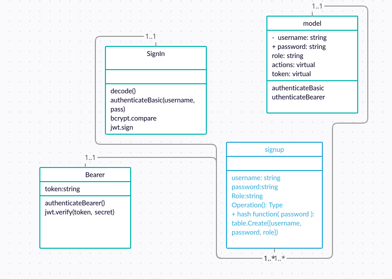

# auth-api
 implement Role Based Access Control (RBAC) using an Access Control List (ACL), allowing to not only restrict access to routes for valid users, but also based on the individual permissions we give each user.

 instructor notes: we create a virtual column for actions and we specify the actions for every role. we also create a column for roles and we use ENUM to make sure we don't have unlimited roles. we use acl as a middleware and pass the action to it  
 Heroku link: https://auth-api-nour-ltuc.herokuapp.com/  
 Pull request: https://github.com/nour-alsatari/auth-api/pull/1  
 UML Diagram: ;
